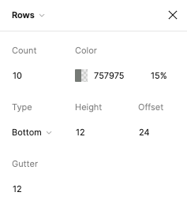

# Figma layout grid
```figma_layout_grid``` is a Flutter package which imitates Figma's layout grid and all its functionalities. It helps you determine whether your UI components match the design file and align properly. 

## Basic usage

Simply wrap a widget you wish to have layout grid rendered on top with ```LayoutGrid```. Except that you have to pass three required parameters that will indicate what layers have to be shown.


```dart
LayoutGrid(
    showColumns: GridConfig.showColumnsNotifier,
    showRows: GridConfig.showRowsNotifier,
    showGrid: GridConfig.showGridNotifier,
    child: const MyHomePage(),
)
```

Note that you can export ```showColumns```, ```showRows``` and ```showGrid``` parameters to a separate config class just like that.

```dart
class GridConfig {
  static final showColumnsNotifier = ValueNotifier(false);
  static final showRowsNotifier = ValueNotifier(false);
  static final showGridNotifier = ValueNotifier(false);
}
```

## Available layouts
```figma_layout_grid``` supports three types of layout overlays - rows, columns and pixel grid.

### Rows

Horizontal stripes with specified height, gutter, margin, offset, arrangement and color.
There is a possibility for fixed rows count with passing desired number in a ```count``` parameter, otherwise rows are rendered dynamically due to the screen limits. 

Example usage

```dart
LayoutGrid(
  ...
  showRows: GridConfig.showRowsNotifier,
  rowsParams: const RowsParams(
    offset: 32.0,
    height: 16.0,
    gutter: 16.0,
  ),
  child: const MyHomePage(),
),
```


### Columns

Vertical stripes with specified height, gutter, margin, offset, arrangement and color.
There is a possibility for fixed columns count with passing desired number in a ```count``` parameter, otherwise columns are rendered dynamically due to the screen limits. 

Example usage

```dart
LayoutGrid(
  ...
  showColumns: GridConfig.showColumnsNotifier,
  columnsParams: const ColumnsParams(
    count: 4,
    width: 64.0,
    margin: 32.0,
  ),
  child: const MyHomePage(),
),
```


### Grid

Square pixel grid with fixed spacing and color. The thickness of a grid is set to 1.

Example usage

```dart
LayoutGrid(
  ...
  gridParams: const GridParams(
    size: 50.0,
    color: Colors.black26,
  ),
  showGrid: GridConfig.showGridNotifier,
  child: const MyHomePage(),
),
```


## Parametrization

As this package mimics Figma's layout grid features you can directly transfer desired outcome into corresponding parameters. The following example shows columns grid set with count = 10, height = 12, gutter = 12, offset = 24, bottom alignment and some custom color.



Which translates to this piece of code

```dart
LayoutGrid(
  ...
  showRows: GridConfig.showRowsNotifier,
  rowsParams: RowsParams(
    count: 10,
    height: 12.0,
    gutter: 12.0,
    offset: 24.0,
    arrangement: RowsArragement.bottom,
    color: const Color(0xFF757975).withOpacity(0.15),
  ),
  child: const MyHomePage(),
),
```

And finally to the following UI.


<br>

There is also a possibility to enable ```SafeArea``` for the layout grid. 

```dart
LayoutGrid(
    ...
    safeArea: true,
    child: const MyHomePage(),
)
```

The above snippet will make the grid overlays avoid the device's intrusions.


## Demo

Try out the example app placed in ```example/layout_grid_demo```. 